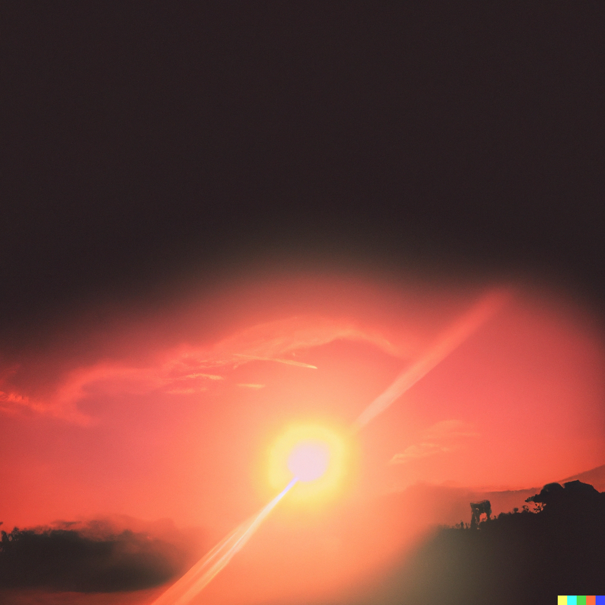

# DALLE-2 или как AI упростил мне работу

> Всякое творчество есть по сути своей молитва. Всякое творчество направлено в ухо Всевышнего.
>
>*Иосиф Бродский*
>
Добро пожаловать многоуважаемый читатель эта небольшая статья посвящена по настоящему интересному инструменту в сфере цифрового арт дизайна, а именно Open AI **DALLE-2**. Результат работы компании Open AI, одним из основателей которой является Илон Маск, стал продукт, который в ближайшее время изменит методы индустрии арт дизайна в корне.

В заключении я приложил изображения которые получились у меня.

## Что такое DALLE-2

В этой статье я буду называть DALLE-2 - нейросетью, искусственным интеллектом, Dalle-2, AI
На данном этапе нам предстоит зарегистрироваться в Waitlist'e чтобы получить доступ к возможностям нейросети \([Ссылка на официальный сайт](https://openai.com/dall-e-2/)\). После получения приглашения, мы можем полноценно изучить и воспользоваться предоставленной нам технологией.

На главной странице нас встречает краткая инструкция и мы готовы творить.

Вводим наши входные данные и жмем кнопку сгенерировать

Получаем 4 изображения

## Как применить

Для копирайтеров, веб-разработчиков, SEO-оптимизаторов искусственный интеллект может создать абсолютно точные изображения соответствующие вашему контенту (В мае 2021 Google анонсировала MUM технологию которая извлекает информацию из изображений, видео, аудио файлов). Изображения сгенерированные c помощью DALLE-2 будут свободны для использования и будут принадлежать вам.

Первые 30 изображений бесплатны, после чего каждое следующее будет стоить 0.13$.

Не стоит забывать про дизайн персонажей, с помощью нейросети мы можем создавать любых мультяшных или реалистичных героев.

## Монетизация

Готовя материал для этой статьи я уже столкнулся с несколькими интересными сервисами. Одним из таких оказался маркетплейс, где можно приобрести или продать входные данные для DALLE-2, здесь есть все возможные паттерны, которые могут прийтись по вкусу любому пользователю.

Так же не стоит забывать про фриланс биржи здесь так же появилось множество предложений по формированию точного запроса к нейросети.

## Заключение
>Мы только в начале грандиозного пути такого типа технологий. И нас еще множество интересного ждет впереди. А до тех пор благодарю за внимание!
>

[DALLE-2](https://openai.com/dall-e-2/)

Пишите свои комментарии они очень важны.

*Тыртычко Роман 2022*
